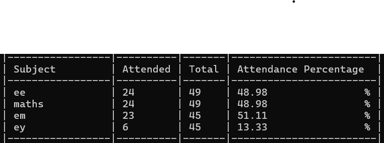

Java Attendance Tracker (CLI)

A simple Java-based command-line tool to manage and track subject-wise attendance using CSV files for data persistence.

Features
--------

- Add subject attendance records
- View overall attendance percentages
- View individual subject attendance
- Data stored in `attendance.csv`
- Input validation for consistency
- Structured and formatted console output

Prerequisites
-------------

- Java JDK (8 or higher)
- Windows OS (for `.bat` scripts)

Project Structure
-----------------

├── Main.java

├── csvread.java

├── csvwriting.java

├── attendance_percentage.java

├── required_attendance_calculator.java

├── attendance.csv

├── build.bat

└── run.bat

How to Use
----------

1. Compile the Project

    build.bat

    This will compile all `.java` source files.

2. Run Commands

    Add a new subject

    run.bat add <subject_name> <attended_classes> <total_classes>

    Example:
    run.bat add Physics 20 28

    Show attendance for all subjects

    run.bat sp

    Show attendance for a specific subject

    run.bat sp <subject_name>

    Example:
    run.bat sp Math

Sample Output
-------------

Notes
-----

- Input is validated to ensure `attended <= total`.
- Subject names are case-sensitive.
- Output formatting can be enhanced with visual elements like progress bars.

Future Enhancements (Optional)
------------------------------
- Web scrapping my college website to track attendance (Main)
- Overhaul of the current output formatting
- Support for deleting/updating records
- Platform-independent CLI runner (replace `.bat` with shell scripts or a unified launcher)

