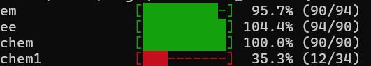

Java Attendance Tracker (CLI)
---------

A simple Java-based command-line tool to manage and track subject-wise attendance using CSV files for data persistence.

Features
--------

- Add subject attendance records
- View overall attendance percentages
- View individual subject attendance
- View the required number of classes to be attend to achieve 75% attendance.
- Data stored in `attendance.csv`
- Input validation for consistency
- Structured and formatted console output

Prerequisites
-------------

- Java JDK (8 or higher)
- Windows OS (for `.bat` scripts)

Project Structure
-----------------

├── Main.java

├── csvread.java 

├── csvwriting.java 

├── attendance_percentage.java

├── required_attendance_calculator.java

├── attendance.csv

├── build.bat

└── run.bat

How to Use
----------

1. Compile the Project

        .\build.bat

    This will compile all `.java` source files.

2. Run Commands

    - **Add a new subject**

            **.\run.bat add** <subject_name> <attended_classes> <total_classes> 

        **Example:**
    
            .\run.bat add Physics 20 28

    - **Show attendance:-** 
    
       *For all subjects:*

            .\run.bat sp

      *For a specific subject*

            .\run.bat sp <subject_name>

        **Example:**
            
            .\run.bat sp Math
    - **Show Classes required for 75% attendance**:-
        
        ***Shows the number of classes required to achieve 75% attendance.***

            .\run.bat rq
                  
    - **Update**:-
        
        Update the attended class count and the total class count with :
            
            .\run.bat update <subject_name> <new_attended_count> <new_total_count> 
        **Example:**
        
            .\run.bat chem 89 90          
    - **Remove Subjects**:
        
            .\run.bat remove <subject_name>

Sample Output
-------------

Notes
-----

- Input is validated to ensure `attended <= total`.
- Subject names are case-sensitive.
- Used a math formula to calculate the classes required to achieve 75% attendance

Future Enhancements (Optional)
------------------------------
- Web scrapping my college website to track attendance (Main)

- Platform-independent CLI runner (replace `.bat` with shell scripts or a unified launcher)

---------------------------------
